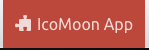
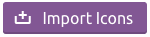
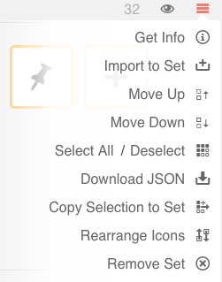

## rlm-icons

In general all icons should be derived from [Font Awesome](https://fortawesome.github.io/Font-Awesome/icons/) if available. The rlm-icons font contains additional icons that weren't found in Font Awesome or have been created from scratch. It was riginally created via [Icomoon](http://icomoon.io). Follow these steps to add or update the rlm-icons font files using icomoon:

1. Click the icomoon app button near the top of the homepage. 

2. Click the Import Icons button on the top toolbar. 

3. Select `common/webroot/fonts/rlm-icons.svg`

4. Select all the existing rlm-icons (there is a shortcut for select all in the menu).

5. Select additional icomoon icons. There are multiple sets available, with various licenses.

6. To add a custom icon choose 'import to set' from the menu.

7. When finished, click "Generate Font" on the bottom toolbar to download a zipfile containing the font files (`.svg`, `.eot`, `.ttf`, and `.woff`)
